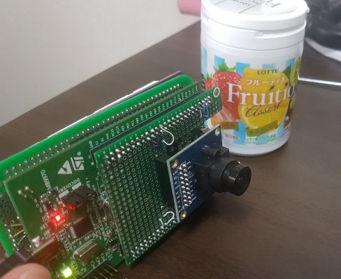
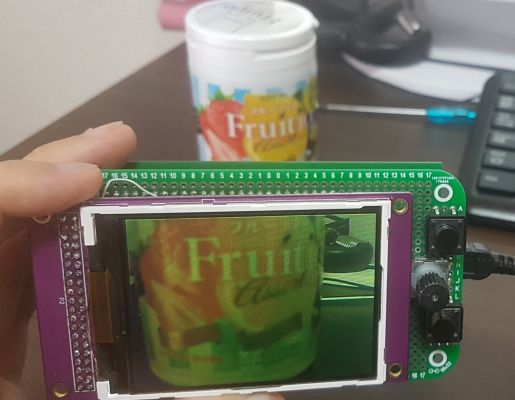

# Digital Camera on STM32F4 Discovery board with Standard Peripheral Libraries
* This is a project to display liveview image captured by camera module
	* Camera module (OV7670)
	* 3.2 inch LCD (ILI9340) (must supports 16-bit parallel interface. I used M032C9341B3 from aitendo)
* This project also contains some sample code to test devices such as:
	* GPIO
	* PWM
	* ADC
	* UART (use for debug terminal)
	* Accelerometer (on board LIS3DSH)
	* OLED (SH1106)
	* NOTE: these devices are not needed for camera application
* In addition to device drivers, simple debug monitor is implemented




# How it works
* After powered on, devices are initialized and continuous capture starts. Liveview image is transferred from camera module to LCD via DMA (there shouldn't be big delay and fps is pretty fast). Meanwhile, main loop just accepts debug commands.
* Debug commands related to camera are:
	* cap 0
		* stop capture
	* cap 1
		* start continuous capture
	* cap 1
		* single frame capture

# Environment
* This project file is for SW4STM32 (System Workbench for STM32)
* STM32F4 Discovery board (STM32F407G-DISC1)
	* need to fly-wire USART2_TX/RX with USB-UART convert IC on ST-LINK side

# Portmap
```
## IO
PA00 = BUTTON, ROTARY_A (TIM5_CH1)
PA01 = N/A, ROTARY_B (TIM5_CH2)
PA02 = USART2 (TX)
PA03 = USART2 (RX)
PA04 = CAMERA_HS(DCMI_HSYNC)
PA05 = accelerator sensor (SCK),   SD_CARD(SPI1_SCK)
PA06 = accelerator sensor (MISO),  CAMERA_PCLK(DCMI_PIXCK)
PA07 = accelerator sensor (MOSI),  SD_CARD(SPI1_MOSI)
PA08 = CAMERA_MCLK(MCO1)
PA09 = N/A
PA10 = SD_CARD(CS)
PA11 = N/A
PA12 = N/A
PA13 = BUTTON1
PA14 = BUTTON2
PA15 = BUTTON3

PB00 = N/A
PB01 = N/A
PB02 = N/A
PB03 = N/A
PB04 = SD_CARD(SPI1_MISO)
PB05 = N/A
PB06 = CAMERA_D5(DCMI_D5)
PB07 = CAMERA_VS(DCMI_VSYNC)
PB08 = CAMERA_D6(DCMI_D6)
PB09 = CAMERA_D7(DCMI_D7)
PB10 = OLED (SCL), CMERA(SCL)
PB11 = OLED (SDA), CAMERA(SDA)
PB12 = N/A
PB13 = N/A
PB14 = N/A
PB15 = N/A

PC00 = N/A
PC01 = ADC test
PC02 = N/A
PC03 = N/A
PC04 = N/A
PC05 = N/A
PC06 = CAMERA_D0(DCMI_D0)
PC07 = CAMERA_D1(DCMI_D1)
PC08 = CAMERA_D2(DCMI_D2)
PC09 = CAMERA_D3(DCMI_D3)
PC10 = N/A
PC11 = CAMERA_D4(DCMI_D4)
PC12 = N/A
PC13 = N/A
PC14 = N/A
PC15 = N/A

PD00 = LCD_D2(FSMC_D2)
PD01 = LCD_D3(FSMC_D3)
PD02 = N/A
PD03 = N/A
PD04 = LCD_RD(FSMC_NOE)
PD05 = LCD_WD(FSMC_NWE)
PD06 = N/A
PD07 = LCD_CS(FSMC_NE1)
PD08 = LCD_D13(FSMC_D13)
PD09 = LCD_D14(FSMC_D14)
PD10 = LCD_D15(FSMC_D15)
PD11 = LCD_RS(FSMC_A16)
PD12 = LED (PWM)
PD13 = LED
PD14 = LED,  LCD_D0(FSMC_D0)
PD15 = LED,  LCD_D1,(FSMC_D1)

PE00 = N/A
PE01 = N/A
PE02 = N/A
PE03 = accelerator sensor (CS)
PE04 = N/A
PE05 = N/A
PE06 = N/A
PE07 = LCD_D4(FSMC_D4)
PE08 = LCD_D5(FSMC_D5)
PE09 = LCD_D6(FSMC_D6)
PE10 = LCD_D7(FSMC_D7)
PE11 = LCD_D8(FSMC_D8)
PE12 = LCD_D9(FSMC_D9)
PE13 = LCD_D10(FSMC_D10)
PE14 = LCD_D11(FSMC_D11)
PE15 = LCD_D12(FSMC_D12)


## Function
ADC3   = test
USART2 = TERMINAL
SPI1   = LIS3DSH(accelerator sensor)
I2C2   = OLED(SH1106)
TIMER4 = PWM test
FSMC   = LCD(ILI9341)
DCMI   = CAMERA(OV7670)
EXTI0  = PA0(BUTTON)

## DMA
DMA2_0 = ADC3
DMA2_1 = LCD(FSMC)
DMA2_7 = CAMERA(DCMI->FSMC(LCD))

## Note
LCD_RESET    = VDD
CAMERA_RESET = VDD
CAMERA_PWDN  = GND
```
